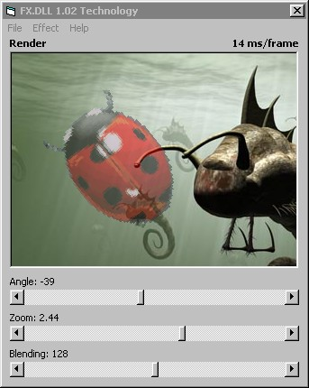



## FX\.DLL 1\.02 SDK

### Description

Added features: emboss, engrave, mosaic, relief and tone effects; bitmap rotation, zoom and rendering (see screenshot); superb light rendering; semitransparent bit-block-transfer etc.

Fixes: fixed problem with bitmap compression, now stretches in HALFTONE mode :)

Included in package: a sample project, API declarations and source-code :) of early library version!

All this and 33 other functions like alpha-blending; ambient-light, blur and other effects; brightness, gamma, hue and saturation correction, RGB, HSL and CMYK calculation etc.

Experience FX technology!
 
### More Info
 

             |
---                |---
**Submitted On**   |2003-05-04 00:54:58
**By**             |[Martins Skujenieks](https://github.com/Planet-Source-Code/PSCIndex/blob/master/ByAuthor/martins-skujenieks.md)
**Level**          |Advanced
**User Rating**    |4.8 (121 globes from 25 users)
**Compatibility**  |VB 4\.0 \(32\-bit\), VB 5\.0, VB 6\.0, VB Script, VBA MS Access, VBA MS Excel
**Category**       |[Libraries](https://github.com/Planet-Source-Code/PSCIndex/blob/master/ByCategory/libraries__1-49.md)
**World**          |[Visual Basic](https://github.com/Planet-Source-Code/PSCIndex/blob/master/ByWorld/visual-basic.md)
**Archive File**   |[FX\_DLL\_1\_0158310542003\.zip](https://github.com/Planet-Source-Code/martins-skujenieks-fx-dll-1-02-sdk__1-45230/archive/master.zip)

